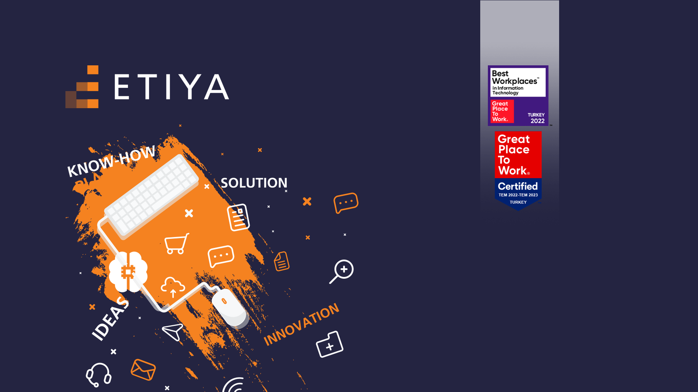

 <h3 align="center">Etiya 5th Term Academy</h3>
 
Etiya 5th Term Academy, includes project task and workshop. 

 
## Build With
 
  

## Used Technologies 
- Java
- Spring Boot
- N-Tier Architecture
- JPA/Hibernate
- Model Mapper
- Maven
- Lombok
- PostgreSQL
## Partnership
<a href="https://github.com/zeynephan49">Zeynep Han</a>  
<a href="https://github.com/Furkan394">Furkan Emre Çakıroğlu</a> 
<a href="https://github.com/MertSoyunmezoglu">Mert Söyünmezoğlu</a> 
<a href="https://github.com/uonurcan">Onur Can</a>
## Contributing
Contributions are what make the open source community such an amazing place to be learn, inspire, and create. Any contributions you make are greatly appreciated.

1. Fork the Project
2. Create your Feature Branch (`git checkout -b f/AmazingFeature`)
3. Commit your Changes (`git commit -m 'Add some AmazingFeature'`)
4. Push to the Branch (`git push origin f/AmazingFeature`)
5. Open a Pull Request

## Contact

Project Link: https://github.com/kadirdemirel/etiya-academy

## Blog Posts
✍️ <a href="https://medium.com/p/43c088727a5a"  style="max-width:100%;">ERD (Varlık İlişki Diyagramı)</a>  

## Acknowledgment

<a href="https://github.com/engindemirog">🙏Engin Demiroğ</a>  
<a href="https://github.com/halitkalayci">🙏Halit Kalaycı</a>  
<a href="https://github.com/iremcibal">🙏İrem Balcı</a>
